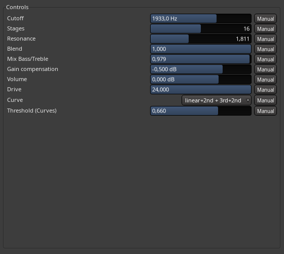

# mnamp
(LV2) Amplifier plugin based on gathered principles and rules of thumb more than any kind of direct emulation of anything

Now works by simple multi-stage low-order polynomial waveshaping, where the input is limited to -1..1 (so that the polynomial functions behave).

NOTE: This *is* just a waveshaper and should be combined with a cabinet simulator / IR loader and impulse response.

Compilation:
Just run make.

It will give a help text explaining the possible options, when run with no arguments.

If you ran make for a plugin target then the corresponding plugin is located in the build/plugin-name.lv2/ directory, ready to copied into your preferred LV2 plugin install directory (as a sub directory that is).
Except on the Windows platform (MSYS2 / MinGW) the manifest.ttl file has to be edited by replacing the reference to plugin-name.so within it with a reference to plugin-name.dll

The Makefile has now been tested on Windows (MSYS2 / MinGW) also.

One may need to provide the following flags in addition to other flags:

    make PLUGIN_TARGET_TYPE=.dll EXECUTABLE_TARGET_TYPE=.exe CXXFLAGS="-I/path/to/lv2/includes ..."

This is provided as is, and available here mostly for my own archiving purposes, so far.

There is currently only available the generic GUI controls possibly provided by the host application used. As far as hosts are considered I recommend a DAW which can plot an analysis of the plugin response, like Ardour does for example, to dial in the parameters more easily.

Control parameters (Updated!)
-----------------------------------------------------------

There is a gain ("Drive") control and some other controls.

Details

Screenshot of the controls as shown in the Ardour DAW.

  * Drive.
    * Controls the amount of curvature (within the limits of a 2nd or 3rd order polynomial).
    * More drive produces more distortion.
    * It is not quite a linear adjustment.
  * Stages
    * Controls the number of polynomial processing stages inside this plugin instance.
    * More stages = more distortion.
    * One can of course use more than one instance in a DAW with other effects in between for example.
    * Integer from 1 to 32.
  * Cutoff.
    * Controls the filters for the EQ section.
    * Linear control from 0.0 Hz to 3000.0 Hz.
    * Frequency bands:
      * Low = lowpass @ cutoff
      * High = highpass @ 6000.0 Hz - cutoff
      * Mid = What is left after subtraction.
  * Resonance.
    * Multiplying factor for the level of "middle" frequencies to mix in.
    * Applied at the beginning only. Not at each stage.
    * Linear control from 0.0 to 5.0.
  * Blend.
    * Amount polynomially processed signal to mix in at each stage.
    * Linear control from 0.0 to 1.0.
  * Mix Bass/Treble.
    * Applied at the beginning only. Not at each stage.
    * Linear control from 0.0 to 1.0.
  * Gain compensation.
    * Adjustment applied to the level after each separate stage.
    * Range: -9.0 dB to +3.0 dB.
  * Volume is a final output level adjustment.
    * Range: -24.0 dB to +12.0 dB.
  * Curve.
    * Index into a selection of some (four) preconfigured blends of polynomial curves.   
    More can be added!
  * Threshold.
    * A factor for the above blending process (dynamic so it reacts to changes during processing).
    * Does not apply to all blends though.   
    This is noted in the label in the generic UI.

View the additional docs (what there is) <a href="https://omnp.github.io/mnamp">online</a>
